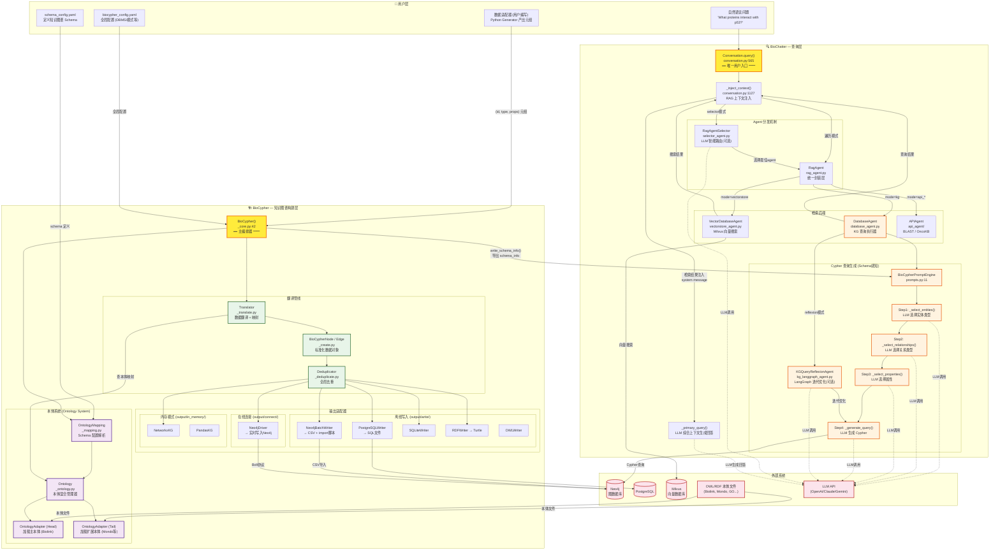
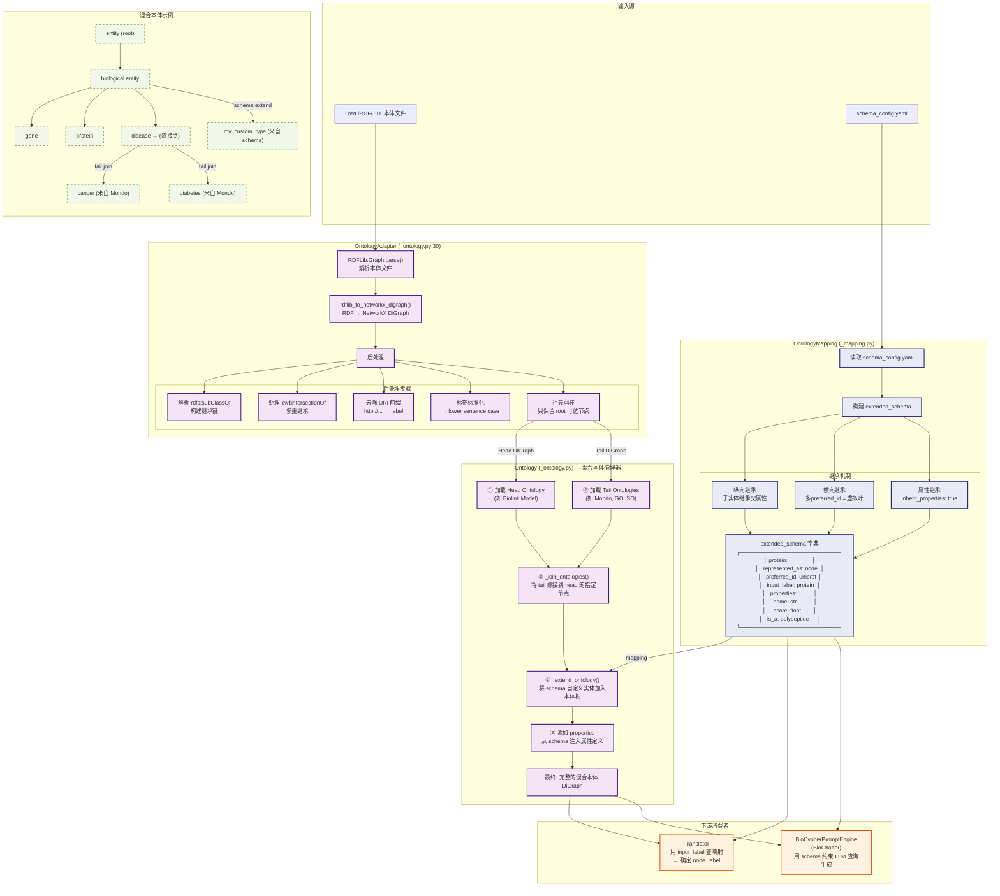
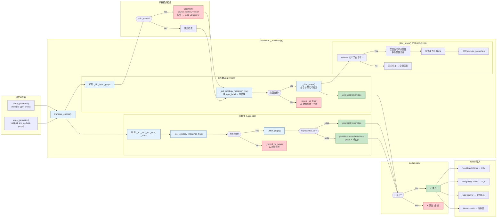
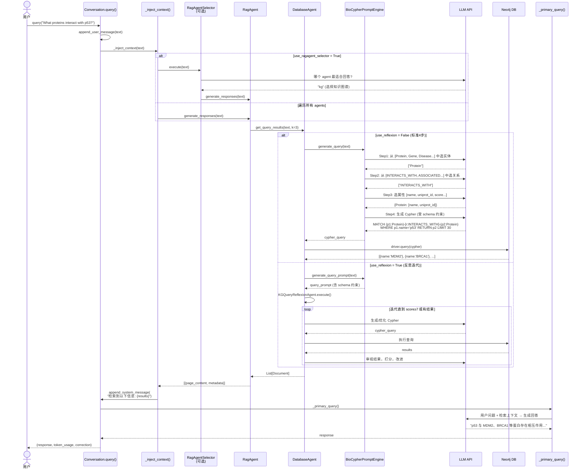
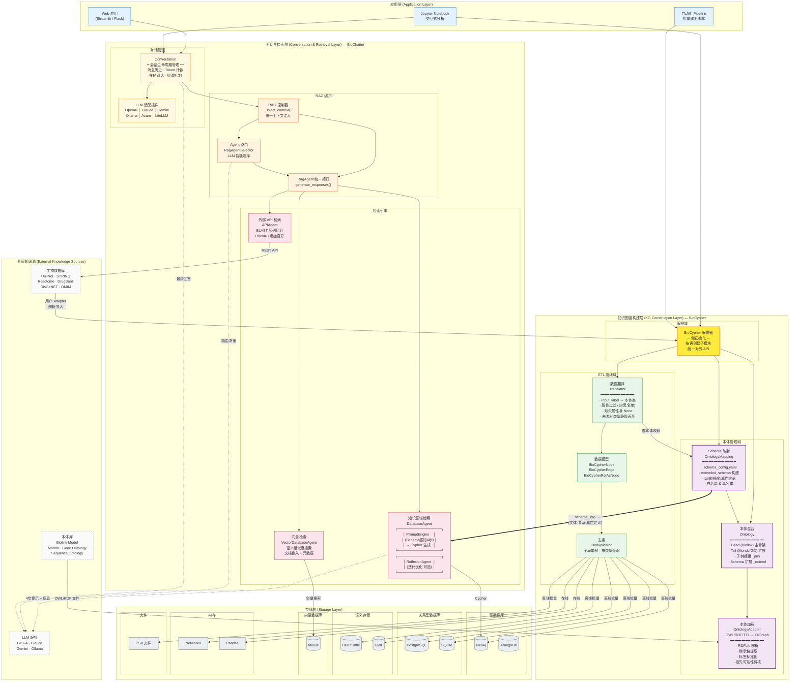

# BioCypher + BioChatter 技术架构图

## 一、总体架构全景图

## 二、本体系统详细架构图

## 三、数据入库管线详细图

## 四、BioChatter 查询管线详细图

## 五、关键模块源码位置速查

| 模块 | 文件路径 | 入口行号 | 核心职责 |
|------|---------|---------|---------|
| **BioCypher 主类** | `biocypher/_core.py` | L42 | 总编排器，懒初始化所有子模块 |
| **OntologyAdapter** | `biocypher/_ontology.py` | L30 | RDFLib解析OWL → NetworkX DiGraph |
| **Ontology** | `biocypher/_ontology.py` | (Ontology类) | Head+Tail 本体混合 + Schema扩展 |
| **OntologyMapping** | `biocypher/_mapping.py` | (类定义) | 解析 schema_config → extended_schema |
| **Translator** | `biocypher/_translate.py` | L22 | input_label映射 + 属性过滤 + 对象生成 |
| **BioCypherNode/Edge** | `biocypher/_create.py` | (数据类) | 标准化实体表示 |
| **Deduplicator** | `biocypher/_deduplicate.py` | (单例) | 全局去重 |
| **Neo4jBatchWriter** | `biocypher/output/write/graph/_neo4j.py` | - | 生成 CSV + admin import 脚本 |
| **Conversation.query()** | `biochatter/llm_connect/conversation.py` | L565 | BioChatter 唯一用户入口 |
| **_inject_context()** | `biochatter/llm_connect/conversation.py` | L1127 | RAG 上下文注入分发点 |
| **RagAgent** | `biochatter/rag_agent.py` | L15 | 统一检索封装 (KG/Vector/API) |
| **RagAgentSelector** | `biochatter/selector_agent.py` | L79 | LLM 智能选择最佳 agent |
| **DatabaseAgent** | `biochatter/database_agent.py` | L12 | KG 查询执行 (Cypher生成+Neo4j执行) |
| **BioCypherPromptEngine** | `biochatter/prompts.py` | L11 | Schema感知的4步Cypher生成 |
| **KGQueryReflexionAgent** | `biochatter/kg_langgraph_agent.py` | L91 | LangGraph 反思式查询优化 |
| **VectorDatabaseAgent** | `biochatter/vectorstore_agent.py` | L115 | Milvus 向量相似度搜索 |

## 六、逻辑架构图

从业务视角展示 BioCypher + BioChatter 的分层逻辑、领域边界与协作关系。

### 逻辑分层说明

| 层次 | 职责 | 所属仓库 |
|------|------|---------|
| **应用层** | Web UI、Notebook 交互、批处理脚本；面向终端用户 | 用户项目 |
| **对话与检索层** | 会话管理、多 LLM 适配、RAG 编排、多后端检索（KG/向量/API） | BioChatter |
| **知识图谱构建层** | 本体加载与混合、Schema 映射、数据翻译与入库 | BioCypher |
| **存储层** | 图数据库、关系型数据库、语义存储、向量库、内存/文件 | 第三方 |
| **外部知识源** | 生物数据库、本体库、LLM 服务 | 第三方 |

### 核心协作关系

- **本体是贯穿两层的纽带**：BioCypher 中 `OntologyMapping` 生成的 `schema_info`（实体、关系、属性定义）既驱动建图时的数据翻译，也传递给 BioChatter 的 `BioCypherPromptEngine` 约束查询生成，确保入库 schema 与查询 schema 严格一致
- **BioCypher 负责 Write Path**（数据 → 本体映射 → 标准化 → 存储）
- **BioChatter 负责 Read Path**（问题 → Schema 感知的查询生成 → 检索 → LLM 回答）
- **两者通过 `schema_config.yaml` / `schema_info` 桥接**，形成"写-读"闭环
